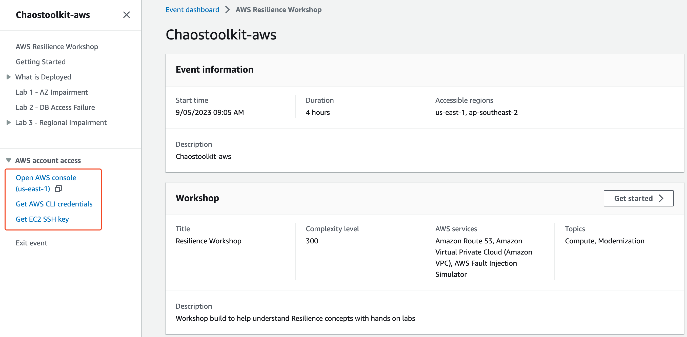

# Chaostoolkit-workshop

## 实验链接：

获取到workshop event实验链接后，在浏览器里打开

[https://catalog.us-east-1.prod.workshops.aws/join?access-code=](https://catalog.us-east-1.prod.workshops.aws/join?access-code=956d-05d10b-67)<*Access-Code*>

## 环境准备：

1. 收到workshop studio的workshop链接后，打开，可以看到左侧的“Open AWS Console"、"Get AWS CLI Credentials"，Get EC2 SSH Key"，分别是进入AWS的console、获取aws cli的登录AK/SK/Token、获取SSH的key文件。我们先点击“Get EC2 SSH Key”获取key文件



2. 获取完Key文件后，打开本地的终端命令行，修改key文件的读写权限为400：

```bash
chmod 0400 ws-default-keypair.pem
```

3. 点击“Open AWS Console"获取主机名，用于SSH登录。


或点击"Get AWS CLI Credentials"获取登录凭证后，通过命令行获取主机名字。该方法需要复制”Linux or macOS(bash)“的登录凭据，并在本地终端执行设置登录凭据。


在本地的终端中执行以下命令，且需要提前安装好awscli工具：

```bash
EC2_PUBDNS=$(aws ec2 describe-instances --query 'Reservations[0].Instances[0].PublicDnsName' --output text --region us-east-1)
```

这里输出类似：
```bash
ec2-54-210-188-68.compute-1.amazonaws.com
```

4. 要登录EC2实验机器，还需要设置安全组，放行MyIP的SSH访问


有些情况下，安全组的MyIP匹配并不是很准，可能导致设置完无法SSH访问的情况，也可以使用以下的方式获取自己的IP：

```bash
curl -s http://whatismyip.akamai.com/
```

5. 通过ssh命令登录到ec2实例

```bash
ssh -i ws-default-keypair.pem ec2-user@ec2-54-210-188-68.compute-1.amazonaws.com
```

或：

```bash
ssh -i ws-default-keypair.pem ec2-user@$EC2_PUBDNS
```

6. 在EC2中安装chaostoolkit-aws工具，注意chaostoolkit和chaostoolkit-aws都是安装在python的venv里，需要执行source命令加载环境，否则无法执行。

```bash
python3 -m venv .chaostk
source .chaostk/bin/activate
pip install -U chaostoolkit
pip install -U chaostoolkit-aws
```

7. 通过命令获取Loadbalancer的DNS，用于检查注入时状态是否正常：

```bash
LB_DNSNAME=$(aws elbv2 describe-load-balancers --query 'LoadBalancers[0].DNSName' --output text) && echo $LB_DNSNAME
```

这里输出类似：
```bash
wordpress-load-balancer-285028187.us-east-1.elb.amazonaws.com
```

## Chaostoolkit实验

### Aurora Failover

本实验使用chaostoolkit-aws扩展提供的rds支持功能，对集群进行failover操作，通过探测集群的状态以及通过刷新web，检查站点的返回，达到混沌工程实验的目的。


创建实验的配置文件，或下载[chaos-aurora.json](files/chaos-aurora.json)，根据自己环境进行修改。

```bash
vi chaos-aurora.json
```

内容如下：

```bash
{
    "title": "Failover Aurora cluster",
    "description": "Verify that the Aurora cluster failover does not affect the application",
    "configuration": {
        "aws_region": "us-east-1"
    },
    "steady-state-hypothesis": {
        "title": "The cluster status is available and web API is health",
        "probes": [
            {
                "name": "aurora-cluster-status",
                "type": "probe",
                "tolerance": ["available"],
                "provider": {
                    "type": "python",
                    "module": "chaosaws.rds.probes",
                    "func": "cluster_status",
                    "arguments": {
                        "cluster_id": "main-aurora-cluster"
                    }
                },
                "pauses": {
                    "after": 15
                }
            }
        ]
    },
    "method": [
        {
            "name": "failover-db-cluster",
            "type": "action",
            "provider": {
                "type": "python",
                "module": "chaosaws.rds.actions",
                "func": "failover_db_cluster",
                "arguments": {
                    "db_cluster_identifier": "main-aurora-cluster",
                    "target_db_instance_identifier": "lab-us-east-1-rdsdbinstance2-incbdzctdowb"
                }
            },
            "pauses": {
                "after": 15
            }
        },
        {            
            "ref": "aurora-cluster-status"
        },
        {            
            "ref": "aurora-cluster-status"
        },
        {            
            "ref": "aurora-cluster-status"
        }
    ],
    "rollbacks":[]
}
```

- 注意aws_region的设置要正确
- cluster_id为集群名字“main-aurora-cluster”
- 设置pauses after:15为了模拟15秒检查一次集群状态，将可以看到集群在某个时间点状态为“available”，在进行failover
- cluster的failover需要指定切换到target节点，target_db_instance_identifier": "lab-us-east-1-rdsdbinstance2-incbdzctdowb"，需要修改为RDS aurora集群的从节点

编写完实验脚本后，通过以下命令执行：

```bash
chaos run chaos-aurora.json
```

实验将会在当前目录下生成log和journal文件，可以通过这些文件，查看chaostoolkit执行实验的过程，以及目标集群的状态信息。可以看到集群在某个时间点状态为“available”，在进行failover。

除了集群本身的状态，往往我们还要验证web服务是否受影响，在一个在线的web系统里，通过观测系统就可以观察web状态，这里通过在web浏览器里查看暴露在ELB上的web服务，并使用`command+shift+r` （windows快捷键不同）强制刷新，可以看到中间某个时间点，会出现503，failover过程中，大部分时间里，并不会对web有影响。ELB的URL查看`echo $LB_DNSNAME`环境变量。

由于workshop默认在北美，可是直接在ec2里使用以下命令检查站点状态：

```bash
while true
do
      curl -sIL -w "%{http_code}" -o /dev/null $LB_DNSNAME && echo -e "\t" && sleep 5
done
```

## 如何扩展chaostoolkit支持更多的AWS服务

chaostoolkit是个实验平台，虽然chaostoolkit-aws提供了AWS常用服务的故障注入和状态探测的功能，但在实验中，action和probe往往比以上的场景要复杂的多，甚至还有一些服务是当前还不支持的，我们可以使用python3代码，对chaostoolkit做扩展。这里也为大家提供了一个简单的例子，演示如何扩展chaostoolkit的实验。

[如何扩展chaostoolkit支持更多的AWS服务](./howto-extend-chaostoolkit-aws.md)
