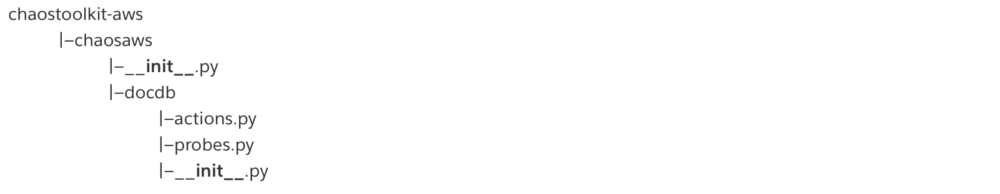

# 如何扩展chaostoolkit支持更多的AWS服务

与Global Region不同，目前AWS中国区还未launch FIS工具，只能采用三方工具对AWS的托管服务进行混沌工程的故障注入。

chaostoolkit-aws项目是被chaostoolkit收集的针对亚马逊云服务提供的一组功能扩展，其覆盖了亚马逊云ec2、ecs、eks、elb、emr、s3等常见常品的服务的故障注入和状态探测，方便亚马逊云的用户通过这些扩展开展针对托管服务的混沌工程实验。

其中actions用于chaostoolkit定义故障注入的行为，这些action会影响目标系统。probes用于chaostoolkit定义稳态假说，每个实验的稳态假说包含一组probe，每次probe都会检查目标系统的某个属性，并判断其结果在预期的容错范围内。如果稳态假说的每次probe都在容错范围内，则判断系统处于正常的稳定状态。

虽然chaostoolkit-aws提供了很多常见服务的扩展，但并不是所有的亚马逊云托管服务的实验都能直接支持，往往需要根据自身的场景，再扩展chaostoolkit-aws的实验场景。chaostoolkit官方提供了工程项目的模版https://github.com/chaostoolkit/chaostoolkit-extension-template 方便用户编写实验扩展，用户也可以直接参考现成的chaotoolkit-aws的rds/ec2等服务的实现，使用aws提供的boto3的python SDK扩展实验。以下过程描述了如何使用python代码扩展支持亚马逊云DocumentDB服务实现集群的failover注入。

开始扩展前，我们需要创建python的venv虚拟环境，并安装chaostoolkit工具。

```
python3 -m venv .chaostk
source .chaostk/bin/activate
pip install -U chaostoolkit
```

安装完chaostoolkit后，将chaostoolkit-aws仓库克隆到本地目录，方便进行代码修改。并使用`make install-dev`安装依赖。

```
git clone https://github.com/chaostoolkit-incubator/chaostoolkit-aws.git
cd chaostoolkit-aws/
make install-dev
```

在本示例中，由于chaotoolkit需要actions执行DocumentDB的failover，probes需要检测DocumentDB的集群状态，因此需要为chaostoolkit配置IAM权限以及AWS Credentials。使用chaostoolkit-aws 需要预先配制AWS环境，比如使用aws configure准备实验需要的credentials配置（配制文件位于`~/.aws/credentials`  或 `~/.aws/config`），并设置好iam权限，确保实验程序有足够的权限执行其操作。
基于最小权限原则，针对failover和集群状态的检查，可以使用以下的iam policy：

```
{
    "Version": "2012-10-17",
    "Statement": [
        {
            "Sid": "VisualEditor0",
            "Effect": "Allow",
            "Action": [
                "rds:FailoverDBCluster",
                "rds:DescribeDBClusters"
            ],
            "Resource": "arn:aws-cn:rds:cn-north-1:*<AWS ID>*:cluster:chaos"
        }
    ]
}
```

### 项目目录结构说明

chaotoolkit-aws项目目录的chaosaws目录主要为aws各托管服务扩展代码实现，建议在扩展时在该目录下为需要扩展的服务创建单独的目录，这里为DocumentDB创建docdb目录。docdb目录的actions.py和probes.py分别为针对扩展服务的代码实现。


chaoaws/docdb/actions.py代码内容如下，通过chaoslib.type库加载混沌工程实验的配置信息，使用chaoaws库的aws_client执行failover_db_cluster操作，强制DocumentDB集群进行failover：

```
import boto3
from botocore.exceptions import ClientError
from chaoslib.exceptions import FailedActivity
from chaoslib.types import Configuration, Secrets

from chaosaws import aws_client
from chaosaws.types import AWSResponse

__all__ = [
    "failover_docdb_cluster",
]
"""
https://chaostoolkit.org/reference/api/experiment/#configuration
Configuration是一个JSON对象，用以承载用户指定（key value）参数
"""
def failover_docdb_cluster(
    docdb_cluster_identifier: str,
    target_docdb_instance_identifier: str = None,
    configuration: Configuration = None,
    secrets: Secrets = None,
) -> AWSResponse:
    """
    Forces a failover for a DocDB cluster.
    docdb为boto3 client标识documentDB
    https://boto3.amazonaws.com/v1/documentation/api/latest/reference/services/docdb.html
    """
    client = aws_client("docdb", configuration, secrets)
    if not docdb_cluster_identifier:
        raise FailedActivity("you must specify the docdb cluster identifier")
    try:
        """
        使用boto3 docdb的failover-db-cluster API来进行数据库的FO
        https://boto3.amazonaws.com/v1/documentation/api/latest/reference/services/docdb/client/failover_db_cluster.html
        docdb_cluster_identifier为当前主库
        target_docdb_instance_identifier为目标主库 - failover之后
        """
        return client.failover_db_cluster(
            DBClusterIdentifier=docdb_cluster_identifier,
            TargetDBInstanceIdentifier=target_docdb_instance_identifier,
        )
    except Exception as x:
        raise FailedActivity(
            "failed issuing a failover for DocDB cluster '{}': '{}'".format(
                docdb_cluster_identifier, str(x)
            )
        )
```

chaoaws/docdb/probes.py代码内容如下，通过chaoslib.type库加载混沌工程实验的配置信息，使用chaoaws库的aws_client执行describe_db_clusters操作，检查DocumentDB的状态信息，并通过filter过滤出指定的集群的状态：

```
from typing import Any, Dict, List, Union

import boto3
from chaoslib.exceptions import FailedActivity
from chaoslib.types import Configuration, Secrets
from logzero import logger

from chaosaws import aws_client
from chaosaws.types import AWSResponse

__all__ = ["cluster_status"]
"""
查询集群状态
"""
def cluster_status(
    docdb_cluster_identifier: str = None,
    filters: List[Dict[str, Any]] = None,
    configuration: Configuration = None,
    secrets: Secrets = None,
) -> Union[str, List[str]]:
    if (not docdb_cluster_identifier and not filters) or (docdb_cluster_identifier and filters):
        raise FailedActivity("cluster_id or filters are required")

    client = aws_client("docdb", configuration, secrets)
    """
    使用自定义describe_db_clusters函数对数据库集群状态进行查询
    docdb_cluster_identifier用以定位所需要查询数据库identity
    返回结果应符合数组filters所包含条件
    """
    results = describe_db_clusters(client=client, docdb_cluster_identifier=docdb_cluster_identifier, filters=filters)
    """
    查询为空
    """
    if not results:
        if docdb_cluster_identifier:
            raise FailedActivity("no cluster found matching %s" % docdb_cluster_identifier)
        if filters:
            raise FailedActivity("no cluster(s) found matching %s" % filters)

    # if all instances have the same status return only single value.
    # eg: "available"
    # if an instances has a different status, return list of unique values
    # eg: ["available", "backing-up"]
    """
    返回的结果为数组，内容为数据库状态，如果所有实例状态一致，则返回available，如果实例状态不一致，返回所有不重复状态
    """
    results = list({r["Status"] for r in results["DBClusters"]})
    if len(results) == 1:
        return results[0]
    return results

###############################################################################
# Private functions
# 使用boto3 client + docdb的识别字符串docdb_cluster_identifier 以及过滤条件进行
# 数据库实例状态查询
###############################################################################
def describe_db_clusters(
    client: boto3.client, docdb_cluster_identifier: str = None, filters: List[Dict[str, Any]] = None
) -> AWSResponse:
    #分页查询
    paginator = client.get_paginator("describe_db_clusters")
    params = dict()

    if docdb_cluster_identifier:
        params["DBClusterIdentifier"] = docdb_cluster_identifier
    if filters:
        params["Filters"] = filters

    results = {}
    #合并结果返回
    for p in paginator.paginate(**params):
        results.setdefault("DBClusters", []).extend(p["DBClusters"])
    logger.info("found %s clusters" % len(results["DBClusters"]))
    return results
```

最后，将docdb的actions和probes实现添加到`chaosaws/__init__.py`文件，注册到chaotoolkit-aws：

```
activities.extend(discover_probes("chaosaws.docdb.actions"))
activities.extend(discover_probes("chaosaws.docdb.probes"))
```

在chaostoolkit-aws目录下运行以下命令，将这些新的扩展安装到venv：

```
python setup.py install
```

扩展完DocumentDB的actions和probes，可以JSON描述一个实验，来验证这些扩展功能是否生效：

```
{
    "title": "Failover DocDB cluster",
    "description": "Verify that the DocDB cluster failover does not affect the application",
    "configuration": {
        "aws_region": "cn-north-1"
    },
    "steady-state-hypothesis": {
        "title": "The cluster status is available and web API is health",
        "probes": [
            {
                "name": "docdb-cluster-status",
                "type": "probe",
                "tolerance": ["available"],
                "provider": {
                    "type": "python",
                    "module": "chaosaws.docdb.probes",
                    "func": "cluster_status",
                    "arguments": {
                        "docdb_cluster_identifier": "chaos"
                    }
                }
            },
            {
                "name": "web-status",
                "type": "probe",
                "tolerance": 200,
                "provider": {
                    "type": "http",
                    "url": "http://localhost:8000/v1/movies/64d89bcbb519d236c519466c",
                    "timeout": 3,
                    "method": "GET"
                } 
            }
        ]
    },
    "method": [
        {
            "name": "failover_demo_docdb_cluster",
            "type": "action",
            "provider": {
                "type": "python",
                "module": "chaosaws.docdb.actions",
                "func": "failover_docdb_cluster",
                "arguments": {
                    "docdb_cluster_identifier": "chaos",
                    "target_docdb_instance_identifier": "chaos2"
                }
            },
            "pauses": {
                "after": 5
            }
        },
        {
            "ref": "web-status"
        },
        {            
            "ref": "docdb-cluster-status"
        }
    ],
    "rollbacks":[]
}
```

以上的配置JSON编写，参考chaostoolkit的手册，注意"docdb_cluster_identifier": "chaos"配置设置了集DocumentDB的集群标识符，"target_docdb_instance_identifier": "chaos2"设置了执行failover的目标实例节点的标识符。除了probe检查集群的状态，用户也可以使用标准的http接口执行probe，去检查使用DocumentDB的应用API接口的返回是否正常。

定义完实验，我们可以通过chaos run命令执行JSON编排的实验，可以看到实验执行了failover的操作，且probe检查的状态在预期之内。

```
(.chaostk) [ec2-user@ip-172-31-7-223 chaostoolkit-aws]$ chaos run experiment.json 
[2023-08-13 10:24:52 INFO] Validating the experiment's syntax
[2023-08-13 10:24:53 INFO] Experiment looks valid
[2023-08-13 10:24:53 INFO] Running experiment: Failover DocDB cluster
[2023-08-13 10:24:53 INFO] Steady-state strategy: default
[2023-08-13 10:24:53 INFO] Rollbacks strategy: default
[2023-08-13 10:24:53 INFO] Steady state hypothesis: The cluster status is available and web API is health
[2023-08-13 10:24:53 INFO] Probe: docdb-cluster-status
[2023-08-13 10:24:53 INFO] found 1 clusters
[2023-08-13 10:24:53 INFO] Probe: web-status
[2023-08-13 10:24:53 INFO] Steady state hypothesis is met!
[2023-08-13 10:24:53 INFO] Playing your experiment's method now...
[2023-08-13 10:24:53 INFO] Action: failover_demo_docdb_cluster
[2023-08-13 10:24:53 INFO] Pausing after activity for 5s...
[2023-08-13 10:24:58 INFO] Probe: web-status
[2023-08-13 10:24:58 INFO] Probe: docdb-cluster-status
[2023-08-13 10:24:58 INFO] found 1 clusters
[2023-08-13 10:24:58 INFO] Steady state hypothesis: The cluster status is available and web API is health
[2023-08-13 10:24:58 INFO] Probe: docdb-cluster-status
[2023-08-13 10:24:58 INFO] found 1 clusters
[2023-08-13 10:24:58 INFO] Probe: web-status
[2023-08-13 10:24:58 INFO] Steady state hypothesis is met!
[2023-08-13 10:24:58 INFO] Let's rollback...
[2023-08-13 10:24:58 INFO] No declared rollbacks, let's move on.
[2023-08-13 10:24:58 INFO] Experiment ended with status: completed
```

除了查看命令的输出，我们也可以查看journal.json日志文件，查看实验脚本的详细输出，确保实验按预期进行。

```
{
  "chaoslib-version": "1.38.0",
  "platform": "Linux-6.1.41-63.114.amzn2023.x86_64-x86_64-with-glibc2.34",
  "node": "ip-172-31-7-223.cn-north-1.compute.internal",
  "experiment": {
    "title": "Failover DocDB cluster",
    "description": "Verify that the DocDB cluster failover does not affect the application",
    "configuration": {
      "aws_region": "cn-north-1"
    },
    "steady-state-hypothesis": {
      "title": "The cluster status is available and web API is health",
      "probes": [
        {
          "name": "docdb-cluster-status",
          "type": "probe",
          "tolerance": [
            "available"
          ],
          "provider": {
            "type": "python",
            "module": "chaosaws.docdb.probes",
            "func": "cluster_status",
            "arguments": {
              "docdb_cluster_identifier": "chaos"
            }
          }
        },
        {
          "name": "web-status",
          "type": "probe",
          "tolerance": 200,
          "provider": {
            "type": "http",
            "url": "http://localhost:8000/v1/movies/64d89bcbb519d236c519466c",
            "timeout": 3,
            "method": "GET"
          }
        }
      ]
    },
    "method": [
      {
        "name": "failover_demo_docdb_cluster",
        "type": "action",
        "provider": {
          "type": "python",
          "module": "chaosaws.docdb.actions",
          "func": "failover_docdb_cluster",
          "arguments": {
            "docdb_cluster_identifier": "chaos",
            "target_docdb_instance_identifier": "chaos2"
          }
        },
        "pauses": {
          "after": 5
        }
      },
      {
        "ref": "web-status"
      },
      {
        "ref": "docdb-cluster-status"
      }
    ],
    "rollbacks": [],
    "dry": null
  },
  "start": "2023-08-13T10:24:53.090984",
  "status": "completed",
  "deviated": false,
  "steady_states": {
    "before": {
      "steady_state_met": true,
      "probes": [
        {
          "activity": {
            "name": "docdb-cluster-status",
            "type": "probe",
            "tolerance": [
              "available"
            ],
            "provider": {
              "type": "python",
              "module": "chaosaws.docdb.probes",
              "func": "cluster_status",
              "arguments": {
                "docdb_cluster_identifier": "chaos"
              }
            }
          },
          "output": "available",
          "start": "2023-08-13T10:24:53.092390",
          "status": "succeeded",
          "end": "2023-08-13T10:24:53.346671",
          "duration": 0.254281,
          "tolerance_met": true
        },
        {
          "activity": {
            "name": "web-status",
            "type": "probe",
            "tolerance": 200,
            "provider": {
              "type": "http",
              "url": "http://localhost:8000/v1/movies/64d89bcbb519d236c519466c",
              "timeout": 3,
              "method": "GET"
            }
          },
          "output": {
            "status": 200,
            "headers": {
              "Content-Type": "application/json; charset=utf-8",
              "Date": "Sun, 13 Aug 2023 10:24:53 GMT",
              "Content-Length": "217"
            },
            "body": "{\"result\":{\"id\":\"64d89bcbb519d236c519466c\",\"name\":\"The Dark Knight\",\"year\":\"2008\",\"directors\":[\"Christopher Nolan\"],\"writers\":[\"Jonathan Nolan\",\"Christopher Nolan\"],\"boxOffice\":{\"budget\":185000000,\"gross\":533316061}}}"
          },
          "start": "2023-08-13T10:24:53.347846",
          "status": "succeeded",
          "end": "2023-08-13T10:24:53.354669",
          "duration": 0.006823,
          "tolerance_met": true
        }
      ]
    },
    "after": {
      "steady_state_met": true,
      "probes": [
        {
          "activity": {
            "name": "docdb-cluster-status",
            "type": "probe",
            "tolerance": [
              "available"
            ],
            "provider": {
              "type": "python",
              "module": "chaosaws.docdb.probes",
              "func": "cluster_status",
              "arguments": {
                "docdb_cluster_identifier": "chaos"
              }
            }
          },
          "output": "available",
          "start": "2023-08-13T10:24:58.698022",
          "status": "succeeded",
          "end": "2023-08-13T10:24:58.800055",
          "duration": 0.102033,
          "tolerance_met": true
        },
        {
          "activity": {
            "name": "web-status",
            "type": "probe",
            "tolerance": 200,
            "provider": {
              "type": "http",
              "url": "http://localhost:8000/v1/movies/64d89bcbb519d236c519466c",
              "timeout": 3,
              "method": "GET"
            }
          },
          "output": {
            "status": 200,
            "headers": {
              "Content-Type": "application/json; charset=utf-8",
              "Date": "Sun, 13 Aug 2023 10:24:58 GMT",
              "Content-Length": "217"
            },
            "body": "{\"result\":{\"id\":\"64d89bcbb519d236c519466c\",\"name\":\"The Dark Knight\",\"year\":\"2008\",\"directors\":[\"Christopher Nolan\"],\"writers\":[\"Jonathan Nolan\",\"Christopher Nolan\"],\"boxOffice\":{\"budget\":185000000,\"gross\":533316061}}}"
          },
          "start": "2023-08-13T10:24:58.800454",
          "status": "succeeded",
          "end": "2023-08-13T10:24:58.804897",
          "duration": 0.004443,
          "tolerance_met": true
        }
      ]
    },
    "during": []
  },
  "run": [
    {
      "activity": {
        "name": "failover_demo_docdb_cluster",
        "type": "action",
        "provider": {
          "type": "python",
          "module": "chaosaws.docdb.actions",
          "func": "failover_docdb_cluster",
          "arguments": {
            "docdb_cluster_identifier": "chaos",
            "target_docdb_instance_identifier": "chaos2"
          }
        },
        "pauses": {
          "after": 5
        }
      },
      "output": {
        "DBCluster": {
          "AvailabilityZones": [
            "cn-north-1a",
            "cn-north-1b",
            "cn-north-1d"
          ],
          "BackupRetentionPeriod": 1,
          "DBClusterIdentifier": "chaos",
          "DBClusterParameterGroup": "chaos",
          "DBSubnetGroup": "database-subnetgroup",
          "Status": "available",
          "EarliestRestorableTime": "2023-08-13T03:40:19.373000+00:00",
          "Endpoint": "chaos.cluster-crkfxr7yhrul.docdb.cn-north-1.amazonaws.com.cn",
          "ReaderEndpoint": "chaos.cluster-ro-crkfxr7yhrul.docdb.cn-north-1.amazonaws.com.cn",
          "MultiAZ": true,
          "Engine": "docdb",
          "EngineVersion": "5.0.0",
          "LatestRestorableTime": "2023-08-13T10:22:15.231000+00:00",
          "Port": 27017,
          "MasterUsername": "chaos",
          "PreferredBackupWindow": "00:00-00:30",
          "PreferredMaintenanceWindow": "tue:06:29-tue:06:59",
          "ReadReplicaIdentifiers": [],
          "DBClusterMembers": [
            {
              "DBInstanceIdentifier": "chaos2",
              "IsClusterWriter": true,
              "DBClusterParameterGroupStatus": "in-sync",
              "PromotionTier": 1
            },
            {
              "DBInstanceIdentifier": "chaos",
              "IsClusterWriter": false,
              "DBClusterParameterGroupStatus": "in-sync",
              "PromotionTier": 1
            }
          ],
          "VpcSecurityGroups": [
            {
              "VpcSecurityGroupId": "sg-07e0b932888bb3d52",
              "Status": "active"
            }
          ],
          "HostedZoneId": "Z010911022JCUWNWK7BG9",
          "StorageEncrypted": false,
          "DbClusterResourceId": "cluster-BHWD5VZYJT7ZHGPNLHL3KIO4O4",
          "DBClusterArn": "arn:aws-cn:rds:cn-north-1:<AWS ID>:cluster:chaos",
          "AssociatedRoles": [],
          "ClusterCreateTime": "2023-08-13T03:39:16.422000+00:00",
          "DeletionProtection": false
        },
        "ResponseMetadata": {
          "RequestId": "c091aae4-a954-4225-b868-f17b4a172486",
          "HTTPStatusCode": 200,
          "HTTPHeaders": {
            "x-amzn-requestid": "c091aae4-a954-4225-b868-f17b4a172486",
            "strict-transport-security": "max-age=31536000",
            "content-type": "text/xml",
            "content-length": "3252",
            "date": "Sun, 13 Aug 2023 10:24:52 GMT"
          },
          "RetryAttempts": 0
        }
      },
      "start": "2023-08-13T10:24:53.355512",
      "status": "succeeded",
      "end": "2023-08-13T10:24:53.585484",
      "duration": 0.229972
    },
    {
      "activity": {
        "name": "web-status",
        "type": "probe",
        "tolerance": 200,
        "provider": {
          "type": "http",
          "url": "http://localhost:8000/v1/movies/64d89bcbb519d236c519466c",
          "timeout": 3,
          "method": "GET"
        }
      },
      "output": {
        "status": 200,
        "headers": {
          "Content-Type": "application/json; charset=utf-8",
          "Date": "Sun, 13 Aug 2023 10:24:58 GMT",
          "Content-Length": "217"
        },
        "body": "{\"result\":{\"id\":\"64d89bcbb519d236c519466c\",\"name\":\"The Dark Knight\",\"year\":\"2008\",\"directors\":[\"Christopher Nolan\"],\"writers\":[\"Jonathan Nolan\",\"Christopher Nolan\"],\"boxOffice\":{\"budget\":185000000,\"gross\":533316061}}}"
      },
      "start": "2023-08-13T10:24:58.592140",
      "status": "succeeded",
      "end": "2023-08-13T10:24:58.596816",
      "duration": 0.004676
    },
    {
      "activity": {
        "name": "docdb-cluster-status",
        "type": "probe",
        "tolerance": [
          "available"
        ],
        "provider": {
          "type": "python",
          "module": "chaosaws.docdb.probes",
          "func": "cluster_status",
          "arguments": {
            "docdb_cluster_identifier": "chaos"
          }
        }
      },
      "output": "available",
      "start": "2023-08-13T10:24:58.597209",
      "status": "succeeded",
      "end": "2023-08-13T10:24:58.697124",
      "duration": 0.099915
    }
  ],
  "rollbacks": [],
  "end": "2023-08-13T10:24:58.805397",
  "duration": 5.717870712280273
}
```

以上过程描述了如何通过chaostoolkit和aws提供的python SDK进行实验的扩展，除了DocumentDB的failover操作，还可以自行扩展DocumentDB reboot、delete db instance等操作。其他boto3支持的AWS服务也可以通过该方式进行故障注入实验的拓展。

## 参考：

https://boto3.amazonaws.com/v1/documentation/api/latest/reference/services/docdb.html#docdb

https://chaostoolkit.org/drivers/aws/

